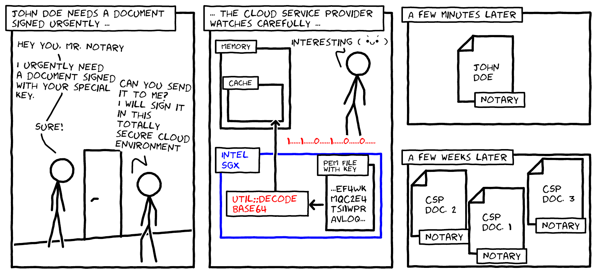

# Util::Lookup

This repository contains the code for the attack on OpenSSL's base64 decoding routine used in decoding RSA keys.



## Publication

This work will appear in the proceedings of the 2021 ACM SIGSAC Conference on Computer and Communications Security. A copy of the paper can be found on [arXiv](https://arxiv.org/pdf/2108.04600.pdf).

```
@inproceedings{sieckberndt2021utillookup,  
    title     = {{Util::Lookup}: Exploiting key decoding in cryptographic libraries},  
    author    = {Sieck, Florian and Berndt, Sebastian and Wichelmann, Jan and Eisenbarth, Thomas},  
    booktitle = {Proceedings of the 2021 ACM SIGSAC Conference on Computer and Communications Security},  
    publisher = {{ACM}},  
    month     = Nov,  
    year      = 2021,  
}
```

## Requirements and how to run

### System config

### Kernel boot config

    GRUB_CMDLINE_LINUX_DEFAULT="nox2apic iomem=relaxed no_timer_check isolcpus=0,1 processor.max_cstate=0 intel_idle.max_cstate=0"

This configures the apic timer into the legacy mode, relaxes a few checks and disables dynamic scheduling for cores 0 and 1. Furthermore, the C-State should be restricted to C0 with the last two parameters.

Maximal C-State can be checked via:

    $ cat /sys/module/intel_idle/parameters/max_cstate

### P-States are disabled via the Bios config

In the Bios we disabled:
  * Intel TurboBoost
  * SpeedStep

### Furthermore the CPU Frequency is locked

This is done by using the cpupower tool from userspace:

    $ sudo cpupower frequency-set -g performance
    $ # Check whether the frequency is already fixed, otherwise try to fix it to the base frequency manually:
    $ # BASE_FREQUENCY has to be set / looked up before hand
    $ sudo cpupower frequency-set -f ${BASE_FREQUENCY}GHz

Currenty core frequency can be checked with:

    $ cat /proc/cpuinfo | grep MHz

### Intel SGX

Install the Intel SGX driver in version 2.11.

### SGX-Step

Finally, SGX-Step has to be installed and configured properly (required version is included as a submodule) and the patched SGX-Step SGX-SDK must be sourced and the SGX-Step kernel module loaded. 
Please refer to the SGX-Step [manual](https://github.com/jovanbulck/sgx-step).

Additionally, it is important to use SGX-Step's bench app (nop slides) to determine the APIC Timer interupt interval and configure it such that single stepping works on the machine in use (see SGX-Step README).

### Building and Running

Steps:

  0. Source the SGX SDK's environment script  and run the ```local_setup.sh``` script (you might need to update the latter to your needs)
  1. Adjust build for either using mitigations or not (Currently configured to use LVI LOAD level mitigation)
  2. Build : ```$ cd ./prime_n_probe && make all MITIGATION-CVE-2020-0551=LOAD```
  3. Update binary offsets: Use objdump to find the binary offsets (in ```encl.so```) of the lookup table ```data_ascii2bin``` (look e.g. for '38393A' and identify the array's start address) and functions ```<evp_decodeblock_int>```, ```<EVP_DecodeUpdate>``` (here we need the address of the inlined decodeblock, look for three successive 'shl') and update the variables ```offset_lt``` (address lookup table), ```offset_decodeblock_adrs```, ```offset_decodeblock_adrs_inline```
  4. Build again (see 2.)
  5. Run: ```$ cd ./prime_n_probe && sudo LD_LIBRARY_PATH=../sgx-step/sdk/intel-sdk/linux-sgx/psw/urts/linux ./pp_lookup```
  6. Evaluate:  
    1. Set number of slices in prime_n_probe/parser/parser.py according to the number of slices of your L3 cache  
    2. Analyze all traces with ```$ python3 parser/parser.py log.out > parsed_result.out```  
    3. Repeat this step (maybe in a loop) to gather data for more than just one run and move all parsed results to a folder  
    4. Run ```$ python3 analyze_results.py --folder results/parsed/```  


## Key reconstruction

There is another [repository](https://github.com/UzL-ITS/rsa-key-recovery) which includes all our code for reconstructing the key from the leakage obtained in this attack. 


